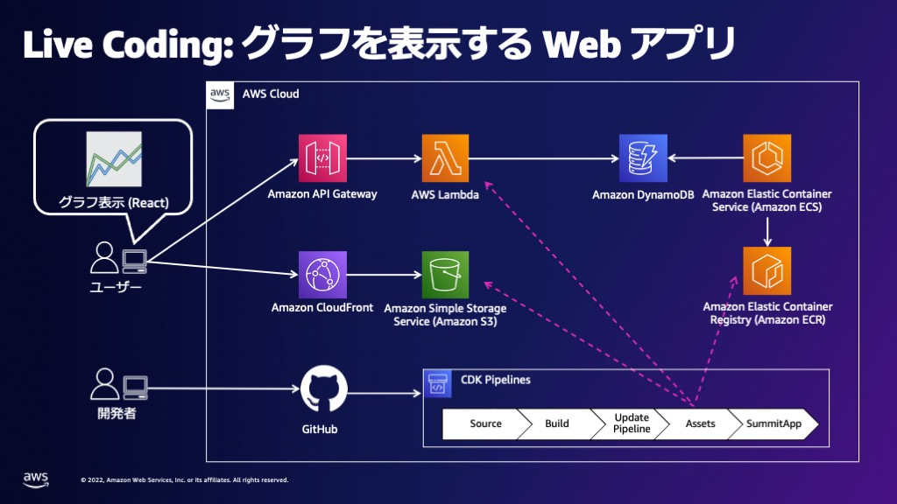

# AWS CDK Chart App Sample

**English follows Japanese**

AWS CDK (v2) を使用してシンプルな Web アプリケーションを構築するサンプルコードです。次のアーキテクチャ図に示す通り、このアプリケーションは 4 つの CDK スタックによって構成されます。



それぞれのスタックとその中にデプロイされるアプリケーションは、アプリケーションの機能よりもコード量が最小限になることを優先して設計されています。

**このサンプルコードはそのまま本番環境に使用されることを意図していません。AWS CDK を活用して簡単なアプリケーションを構築するための例を示したものです。**

AWS Summit Online Japan 2022 Developer Zone のセッション『AWS CDK で CI/CD つきの Web アプリを作ろう！開発風景を Live Coding でお届けします』でライブコーディングの様子を紹介しました。

---

This is a sample code to build a simple Web application with AWS CDK (v2). As described in the architecture diagram, this application is constructed by 4 CDK stacks.

Each stacks and applications are designed to minimize the amount of code over the functionality of the application.

**This sample is not meant to be used as production as-is, but as an inspiration on how to leverage AWS CDK to build a simple application.**

In AWS Summit Online Japan 2022 Developer Zone session titled "Let's make a Web application with CI/CD by AWS CDK! We will demonstrate daily development process by live coding", we showed live coding with this code.

## Requirements

- [Node.js](https://nodejs.org/) (>= `16.0.0`)
  - `npm` (>= `8.1.0`)
- [Go](https://go.dev/) (>= `1.18.0`)
- [Git](https://git-scm.com/)
- [Docker](https://www.docker.com/get-started/)

## How to deploy

### 1. Create your private Git repository from a copy

To store [context information](https://docs.aws.amazon.com/cdk/v2/guide/context.html), you can host CDK code in a private Git repository. To achieve this, you can **copy this public repository instead of folking it**.

First, create your private repository in GitHub. Then, follow those steps:

```sh
git clone git@github.com:aws-samples/cdk-chart-app-sample.git
cd cdk-chart-app-sample
git remote set-url origin git@github.com:<YOUR_NAMESPACE>/<YOUR_REPOSITORY>.git
git push origin main
```

### 2. Install dependencies

```sh
npm ci
cd webapp/dashboard
npm ci
```

### 3. Create AWS CodeStar connection

[Create a connection - Developer Tools console](https://docs.aws.amazon.com/dtconsole/latest/userguide/connections-create.html)

### 4. Configure your cdk.json

Replace values with yours:

```json
    "source-repository": "aws-samples/cdk-chart-app-sample",
    "source-branch": "main",
    "source-connection-arn": "arn:aws:codestar-connections:ap-northeast-1:123456789012:connection/xxxxxxxx-xxxx-xxxx-xxxx-xxxxxxxxxxxx"
```

### 5. Deploy CDK Pipelines

CDK Pipelines expects the source code has been pushed in connected repository. First time of your deployment, you should `git push` before running `cdk deploy`.

```sh
git push origin main
npx cdk deploy --all
```

Once CDK Pipelines is created, changes to the CDK application will be reflected by `git push`. If you want to change the pipeline stack itself, you will need to run `cdk deploy` again from your terminal.

## Useful commands

[AWS CDK Toolkit \(cdk command\) \- AWS Cloud Development Kit \(CDK\) v2](https://docs.aws.amazon.com/cdk/v2/guide/cli.html)

- `npm run test` perform the jest unit tests
- `cdk deploy` deploy this stack to your default AWS account/region
- `cdk diff` compare deployed stack with current state
- `cdk synth` emits the synthesized CloudFormation template

## Security issue notifications

See [Security issue notifications](CONTRIBUTING.md#security-issue-notifications) for more information.

## License

This library is licensed under the [MIT-0](https://github.com/aws/mit-0) License. See the [LICENSE](LICENSE) file.
